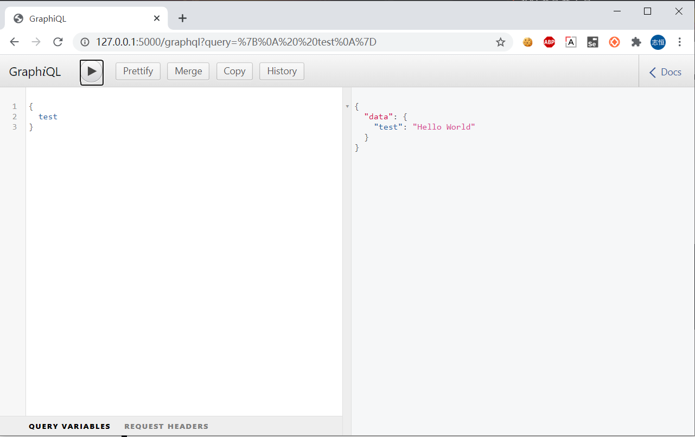

# Flask-Graphql 使用 demo

## 安装

克隆或下载项目，安装依赖。

```shell
$ pip install -r requirements.txt
```

## 启动服务

```shell
$ python app.py

* Serving Flask app "app.py" (lazy loading)
 * Environment: production
   WARNING: Do not use the development server in a production environment.
   Use a production WSGI server instead.
 * Debug mode: on
 * Running on http://127.0.0.1:5000/ (Press CTRL+C to quit)
 * Restarting with stat
 * Debugger is active!
 * Debugger PIN: 208-740-173
```

## Graphql 使用

访问：`http://127.0.0.1:5000/graphql`


